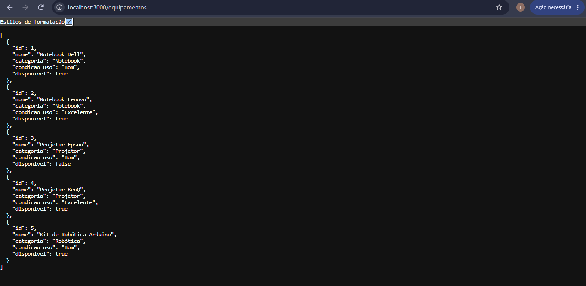
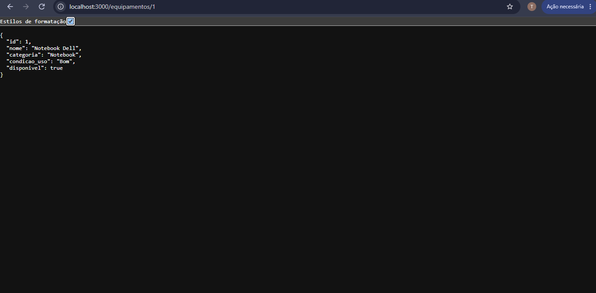
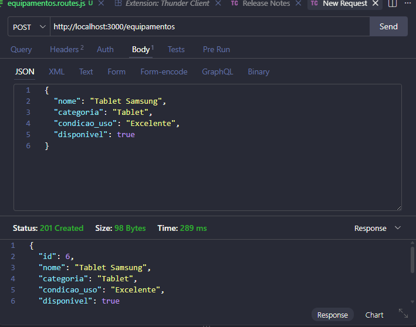
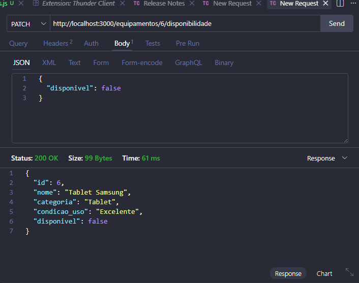

# Sistema de Empréstimo de Equipamentos

Projeto desenvolvido para implementar a camada de acesso aos dados de um sistema de empréstimo de equipamentos.

## Tecnologias utilizadas

- Node.js
- Express
- PostgreSQL
- pg
- dotenv
- Thunder Client

## Estrutura do projeto

- `routes`: recebe as requisições HTTP e chama o service.
- `services`: contém a classe responsável pelas operações no banco de dados.
- `database.js`: realiza a conexão com o banco PostgreSQL.
- `index.js`: inicia o servidor da aplicação.

## Operações implementadas

- Listar todos os equipamentos.
- Buscar um equipamento pelo ID.
- Cadastrar um novo equipamento.
- Alterar somente a disponibilidade de um equipamento.

## Decisões adotadas

O service foi implementado como uma classe e seus métodos de acesso ao banco são assíncronos.

Todo o SQL está localizado no service. A camada routes não acessa diretamente o banco de dados.

As consultas utilizam parâmetros `$1`, `$2`, `$3` e `$4` e os valores são enviados separadamente, evitando a concatenação de dados recebidos pela aplicação nos comandos SQL.

Quando um equipamento não é encontrado pelo ID, o service retorna `null` e a camada routes responde com o status HTTP `404`.

Os métodos retornam somente os dados necessários para a camada routes.

## Rotas

### Listar equipamentos

GET /equipamentos

### Buscar equipamento pelo ID

GET /equipamentos/:id

### Cadastrar equipamento

POST /equipamentos

### Alterar disponibilidade

PATCH /equipamentos/:id/disponibilidade

## Evidências dos testes

### Listagem de equipamentos

### Busca por ID

### Cadastro de equipamento

### Alteração de disponibilidade

